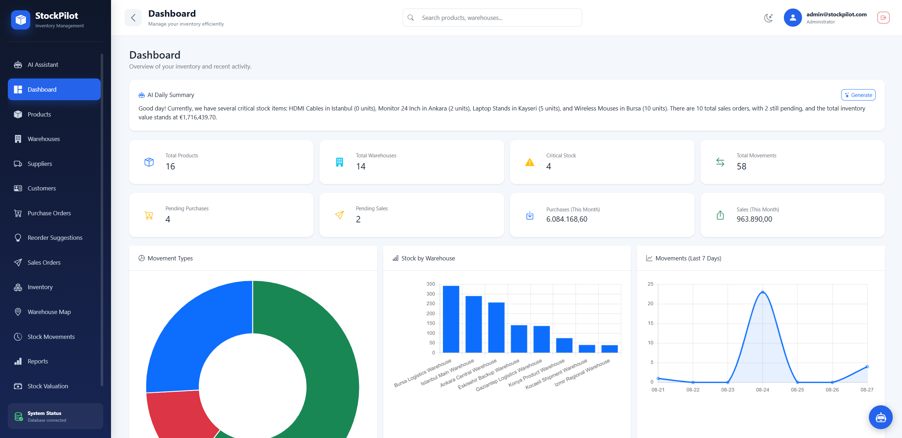
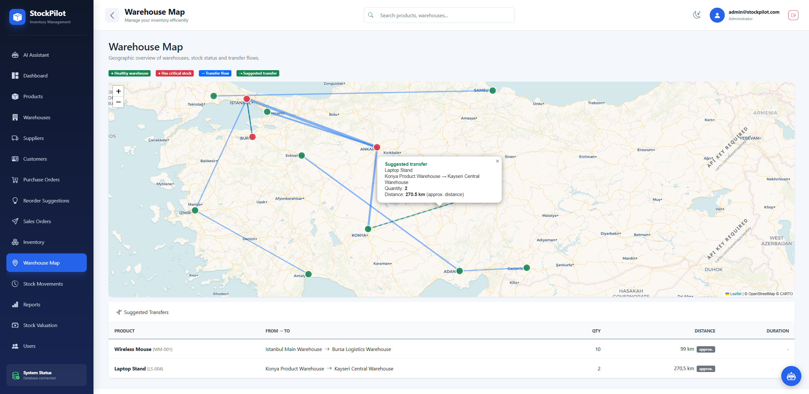
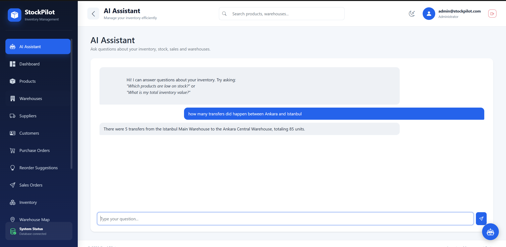
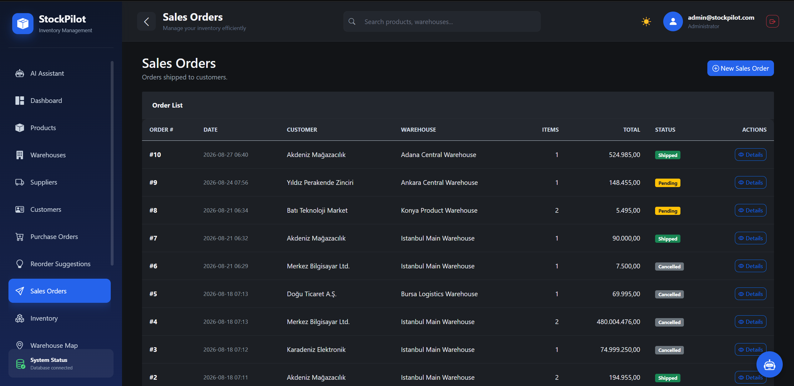

# StockPilot

**StockPilot** is a multi-warehouse inventory management system built with ASP.NET Core MVC. It covers the full supply chain — from purchasing goods from suppliers, storing them across multiple warehouses, to shipping them to customers — enriched with stock reservation, geographic visualization, financial analysis, and an AI assistant that answers questions about your inventory in natural language.

---

## Table of Contents

- [Overview](#overview)
- [Features](#features)
- [Screenshots](#screenshots)
- [Technology Stack](#technology-stack)
- [Architecture](#architecture)
- [Getting Started](#getting-started)
- [Configuration](#configuration)
- [Default Credentials](#default-credentials)

---

## Overview

StockPilot models a realistic warehouse management workflow across multiple locations. Goods flow in one direction through the system: purchased from **suppliers**, received into **warehouses**, and shipped to **customers**. On top of this core flow, the system adds stock reservation to prevent overselling, automatic reorder suggestions, a geographic map of warehouses with distance-based transfer recommendations, ABC value analysis, and a natural-language AI assistant powered by function calling.

---

## Features

**Authentication & Authorization**
- Login, logout and registration with ASP.NET Core Identity
- Two roles (Admin / User) with page-level protection
- User management panel to activate/deactivate accounts (Admin only)

**Product & Warehouse Management**
- Full product catalog with SKU, unit price and reorder level
- Multiple warehouses with location and geographic coordinates
- Soft-delete (deactivation) instead of hard deletion everywhere
- Global search across products (name/SKU) and warehouses (name/location)

**Stock Operations**
- Stock In, Stock Out and inter-warehouse Transfer, all transaction-based
- Movement history with filtering and pagination
- Every operation is tied to the performing user

**Stock Reservation**
- Physical, reserved and available quantity tracked per product-warehouse
- Sales orders reserve stock on creation; shipping releases the reservation and reduces physical stock; cancellation releases the reservation
- Reservation is enforced across manual stock-out and transfer operations, preventing reserved goods from being consumed elsewhere

**Purchasing & Sales**
- Purchase orders with dynamic line items and automatic pricing
- Receiving a purchase order performs a transaction-based multi-item stock-in
- Sales orders mirror purchasing, with a two-pass availability check before shipping
- PDF generation for both order types

**Automatic Reorder Suggestions**
- Detects products below their reorder level and suggests order quantities
- One-click creation of a draft purchase order

**Warehouse Map**
- Interactive map of warehouses at their real coordinates
- Color-coded markers by stock health (critical vs. healthy)
- Transfer flow lines between warehouses, weighted by volume
- Distance-based transfer suggestions using real road distance (with an approximate fallback)

**Stock Valuation & ABC Analysis**
- Total inventory value and per-product valuation
- ABC classification by cumulative value (Pareto principle)
- Dead-stock detection for items with no recent movement

**Dashboard**
- Summary cards, critical stock and recent activity
- Chart.js visualizations (movement types, stock by warehouse, 7-day trend)
- On-demand AI-written daily summary

**AI Assistant**
- Natural-language questions answered from real data via function calling
- Nine read-only tools covering inventory, sales, valuation and transfers
- Available as a dedicated page and as a floating widget on every page
- Answers in the language of the question (Turkish / English)

**Reporting & Import**
- Excel reports (stock status, movements, purchase/sales orders) with date filtering
- Bulk product import from Excel with row-level validation

**User Experience**
- Dark mode with persisted preference
- Responsive layout with a consistent design system

---

## Screenshots

### Dashboard
Overview of inventory with summary cards, Chart.js visualizations and an AI-generated daily summary.



### Warehouse Map
Geographic view of all warehouses with stock-health markers, transfer flow lines and distance-based transfer suggestions.



### AI Assistant
Ask questions about inventory, stock, sales and transfers in natural language; answers are generated from real data.



### Sales Orders (Dark Mode)
Master-detail sales orders with Pending / Shipped / Cancelled states, shown in dark mode.



---

## Technology Stack

| Layer | Technology |
|-------|-----------|
| Framework | ASP.NET Core MVC (.NET 8) |
| ORM | Entity Framework Core (Code First) |
| Authentication | ASP.NET Core Identity |
| Database | SQL Server |
| Excel | ClosedXML |
| PDF | QuestPDF |
| Charts | Chart.js |
| Maps | Leaflet + CARTO tiles |
| Routing/Distance | OSRM (with Haversine fallback) |
| AI | OpenAI API (GPT-4o mini, function calling) |

---

## Architecture

StockPilot follows a four-layer architecture with a generic repository pattern:

- **EntityLayer** — domain entities (Product, Warehouse, WarehouseStock, orders, etc.)
- **DataAccessLayer** — EF Core `DbContext`, generic repository and data-access abstractions
- **BusinessLayer** — business rules and services (inventory, orders, reservation, valuation, reorder)
- **Web** — MVC controllers, views, view models and UI services (map, PDF, AI assistant)

Schema changes are always applied through EF Core migrations. Removal is handled via soft-delete (an `IsActive` flag) rather than physical deletion.

---

## Getting Started

### Prerequisites
- [.NET 8 SDK](https://dotnet.microsoft.com/download)
- SQL Server (LocalDB, Express or full)
- An [OpenAI API key](https://platform.openai.com/) (for the AI assistant)

### Steps

1. **Clone the repository**
   ```bash
   git clone https://github.com/<your-username>/StockPilot.git
   cd StockPilot
   ```

2. **Configure the database connection**

   Open `StockPilot.Web/appsettings.json` and set the `DefaultConnection` string to point to **your own** SQL Server instance. The value in the repository points to a specific development machine and will not work elsewhere.

   ```json
   "ConnectionStrings": {
     "DefaultConnection": "Server=YOUR_SERVER_NAME;Database=StockPilotDB;Trusted_Connection=True;TrustServerCertificate=True;"
   }
   ```

   Replace `YOUR_SERVER_NAME` with your SQL Server name. Common examples:
   - LocalDB: `Server=(localdb)\\MSSQLLocalDB;...`
   - SQL Server Express: `Server=.\\SQLEXPRESS;...`
   - Named instance: `Server=YOUR-PC\\SQLEXPRESS;...`

   You can find your server name in SQL Server Management Studio (SSMS) on the connection screen.

3. **Configure the OpenAI API key** (see [Configuration](#configuration) below)

4. **Create the database**

   There are two options. **Option A is recommended** — it gives you the database already populated with sample data (products, warehouses, orders, coordinates), so the app looks exactly as intended on first run.

   **Option A — Restore from the provided SQL script (with sample data)**

   A complete SQL script is included at [`database/StockPilotDB.sql`](database/StockPilotDB.sql). It creates the `StockPilotDB` database, all tables, and all sample data in one step.

   - Open **SQL Server Management Studio (SSMS)** and connect to your SQL Server.
   - Open the file `database/StockPilotDB.sql` (File → Open → File).
   - Click **Execute** (or press F5).
   - The `StockPilotDB` database is created and filled with data.

   With this option you do **not** need to run `Update-Database` — the script already includes the schema and the EF Core migration history.

   **Option B — Create an empty database with EF Core (no sample data)**

   The project uses **Entity Framework Core Code First**, so EF Core can build an empty database from the migrations. In Visual Studio, open the **Package Manager Console** (Tools → NuGet Package Manager → Package Manager Console), set **Default project** to `StockPilot.DataAccessLayer` with `StockPilot.Web` as the startup project, then run:

   ```
   Update-Database
   ```

   This creates the database with all tables but **no** product/warehouse data — only the seeded roles and admin account appear on first run.

5. **Run the application**
   ```bash
   dotnet run --project StockPilot.Web
   ```

   On first run, the application ensures the **Admin** and **User** roles and a default administrator account exist (see [Default Credentials](#default-credentials)).

### Troubleshooting

- **Cannot connect to the database** — verify the server name in the connection string and that your SQL Server service is running.
- **The script fails because the database already exists** — drop the existing `StockPilotDB` first, or run only the parts you need.
- **`Update-Database` fails** — confirm the startup project is `StockPilot.Web` (so the connection string is read) and the Default project is `StockPilot.DataAccessLayer` (where the migrations live).
- **The AI assistant returns a configuration error** — the OpenAI API key is missing; see [Configuration](#configuration).

---

## Configuration

The AI assistant requires an OpenAI API key. To keep the key out of source control, it is stored using **.NET User Secrets** rather than in `appsettings.json`.

Right-click the `StockPilot.Web` project → **Manage User Secrets**, then add:

```json
{
  "OpenAI:ApiKey": "sk-your-openai-api-key"
}
```

The key is read from configuration at runtime and never committed to the repository.

---

## Default Credentials

A seed administrator account is created on first run:

- **Email:** `admin@stockpilot.com`
- **Password:** `Admin123!`

---

_StockPilot was developed as an internship project. It is intended for educational and demonstration purposes._
